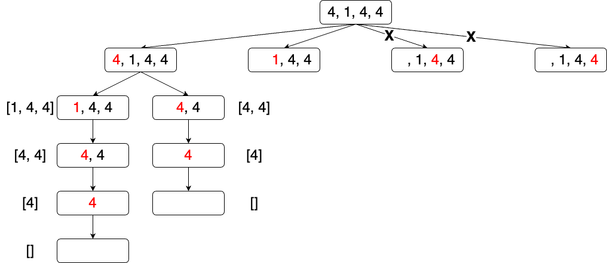

# 子集 II问题
这道题与子集最大的区别在于数组中存在重复元素，需要考虑去重的操作，但是我没考虑出来。因此参考了[@代码随想录](https://www.bilibili.com/video/BV1vm4y1F71J/?spm_id_from=333.788&vd_source=9c364d9aa07f4d54211f586cd1257691)的思路。  
以数组 `[4, 1, 4, 4]` 为例，这道题的首个难点在于，需要对数组进行排序，否则就会如下图一般，出现两个 `4, 4` 子节点，导致重复。  

  

第二个难点在于对 `[1, 4, 4, 4]` 中，多个4的一个去重，即跳过重复4即可，方法很多，不做赘述。  

