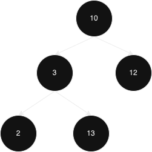

# 验证二叉搜索树问题
## 错误思路
很自然的一个思路，就是递归判断子树是否为平衡二叉搜索树，然后判断子树的根节点和根节点的关系。  
但是这里面有一个很大的问题就是，假设一个树长这样  

以上述思路，它的子树是平衡二叉树，它本身与子树根节点也是平衡的，但是这棵树不是平衡二叉树，因为左子树中，13比根节点10大。因此这是一个很自然的错误思路。  

## 中序遍历
再次回看平衡二叉搜索树的定义，左侧节点比根节点小，右侧节点比根节点大，因此我们可以使用中序遍历: 左 -> 根 -> 右 的形式，得到一个数组，然后判断数组是否为单调递增数组即可。  
如何在不使用数组的情况下遍历呢？我们可以使用一个全局变量 maxVal 来记录，因为我们知道，中序遍历一定是单调递增的，因此我们使用 maxVal 来记录上一个节点，将 maxVal 设置为空int指针。当当前节点大于maxVal时，或者maxVal为空时，置换maxVal；反之则返回false。  
