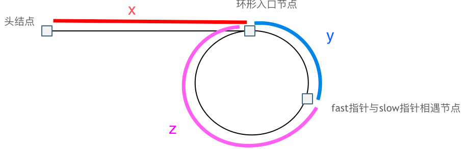

# 环形链表 II 问题

假设存在环，且如图所示： 

  

由图片结合快慢指针，假设快指针进入环后循环了n圈，与s指针相遇，~~我们可以很直观地得到一个恒等式:  

x + y = 2(x + y) - n(y + z)

整理后得到: 

x + y = n(y + z)

x = (n - 1)(y + z) + z

由于(y + z)是一个环的长度，因此任意增加环或者任意减少环，最终相交的位置始终在同一个点不会变化。因此当快指针从相遇位置以速度为1行进，慢指针从头开始以相同速度行进，快指针会在绕了n圈之后，再走z的长度，与慢指针在入口相遇。   
想明白上述的推导后，按照常规思路设置虚拟头结点+双指针即可解出此题。

图源: https://leetcode.cn/problems/linked-list-cycle-ii/solutions/441306/142-huan-xing-lian-biao-ii-jian-hua-gong-shi-jia-2/