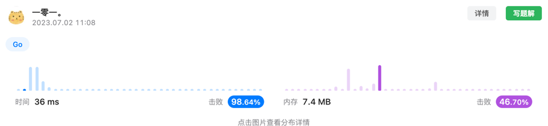

# 三数之和问题
这道题第一反应，是利用回溯算法找出所有的三数组合，计算总加和之后返回，因此出现了难点一，即如**何去除重复的数组**，难点二，**找出所有三数组合**。  
针对难点一，自然而然想到了对数组排序之后，生成一个hash表记录已经出现过的数组。  
但是，在进行了代码提交后，超出了时间限制，再次思考时发现，有了两个优化点:
- 由于存在重复的组合，因此在遍历的过程中，可以跳过重复组合的循环，有效地降低运行时间。    
- 由于解决难点一时，对数组已经进行排序了，同时假设我们的中间数组(包含2个数字的数组)为[]int{-1, 1}，此时已经和为0，后续数字均大于1，因此无论后续是什么数字，都不可能使得三元数组和为0；同理于一元数组[]int{1}。  

因此可以解法二考虑三指针对该题进行解决，固定一个指针(i)，然后使用一前一后的双指针(j & k)找出二元数组，同时对固定指针(i)和固定指针与双指针中的头指针之和(i & j)的和进行监视，任意出现大于0，则直接跳出循环，降低时间复杂度。
同时，在查看题解时，收获了一个很好的思路，在找到一个和为0的组合之后，对后续(前方)元素依次进行遍历，跳去相同元素，有效地避免了重复问题，并且去除了hash表，降低了空间复杂度。  

> 来自: @wu_yan_zu(https://leetcode.cn/u/wu_yan_zu/)