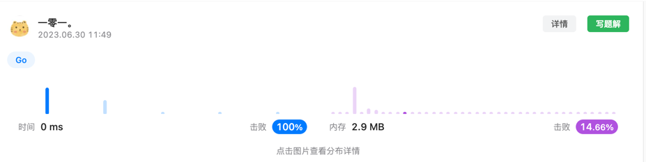

# Solution 1
常规的一个递归回溯法，建立一个record字典记录已有的括号串，并通过依次往现有字符串中添加一个新的括号进行递归计算。
最终将结果中key长度为 2 * n 的keys返回。 时间复杂度为 `分析不出来`，空间复杂度为 `分析不出来`，但是基本与时间复杂度量级相当。
这就导致了该解法的空间复杂度较高。
> 欢迎看见的大佬如果有时间，可以在 issue 中帮助分析一下，不胜感激。  
> 按照题解区大佬 @灵茶山艾府(https://leetcode.cn/u/endlesscheng/)的分析  
> 时间复杂度为 O(C(2n,n)) or O(4^n / sqer(n))，那么空间复杂度也类似时间复杂度

# Solution 2
该题解为大佬 `@灵茶山艾府` 的题解，巧妙的利用了栈的思想，避免了使用哈希表进行记录，实现了栈的重复利用，是个很好的值得学习的方法。  
详见函数 `generateParenthesis_2` 极大的降低了空间复杂度至 `O(n)`
