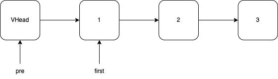
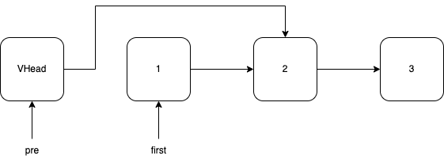
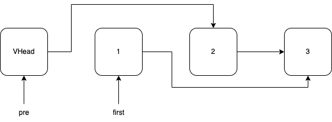
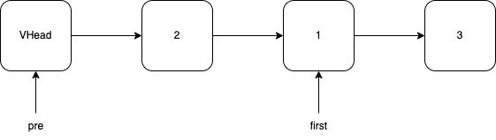

# 两两交换链表中的节点
链表的基础应用考察，主要在于指针之间的变化，避免出现空指针的问题。  
整体思想为首先声明一个虚拟头节点，在单链表中，使用虚拟头节点可以很好地避免空链表的问题。然后使用双指针pre和first对链表进行迭代。  

  

首先将pre.Next设置为first.Next，此时：  

  

再将first.Next设置为pre.Next.Next，此时：  

  

最后将pre.Next.Next设置为first，即完成了一次交换过程。  

  

然后按照上述的方法迭代，直到first或者first.Next为nil时结束。

