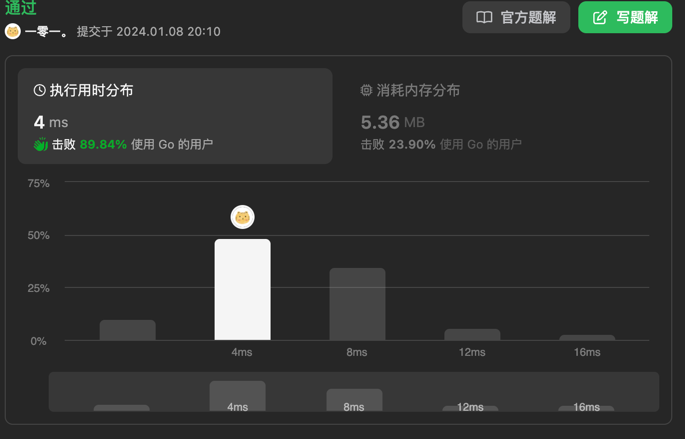

# 打家劫舍 III
这一道题目前我想到了两种解决方法。  
由于特性，在某一节点处，要么选择该**节点本身+孙子四节点**，要么选择**子节点**，即可将题目转变为自底向上的遍历问题（广度优先搜索）。即每层计算完成后，每个节点记录该节点下子树中可选择的最大值，再在上层节点进行比较选择。  
第二种解法是递归式解法，即同一个DP状态数组，记录选择该节点和不选择该节点的一个值，通过递归的方式进行遍历。   
第一种方法的时间复杂度为**O(2n)**，空间复杂度为**O(n)**，第二种方法的时间复杂度为**O(n)**，空间复杂度为**O(2n)**。  
两种方法均可通过。  

