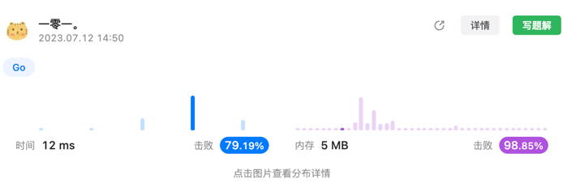

# 前 K 个高频元素问题
俗称 TOPK 问题，很经典的大小根队题目，重点在于大小根堆的实现以及选择，由于我们需要 TOPK 的输出，那我们在选用堆时，只需要维护一个长度为 k 的堆即可，因此我们在插入的同时，需要 Pop 掉一些出现频率过小的一些树，由于堆一般从头结点 Pop，因此 TOPK 问题选用小根堆进行解决。  
在本题中，与常规小根堆不太类似的有一点:
- 我们插入的是数字，但是比较的是他们之前的频率

别的就是一个正常的堆问题，网上教程有很多，不再赘述。  

  
