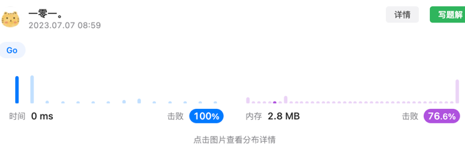

# 字符串相乘问题

这道题由于可能数字很大，导致Go语言中的int64超出表达范围，因此需要模拟实现以前小学时做乘法的方法进行大数乘法。

假设输入的数字是 `99 * 9`，因此结果我们可以知道一定小于 `100 * 10 = 1000`，因此结果长度一定小于:  

 resultLen := len(num1) + len(num2) + 1 
  

因此我们可以生成一个result数组来保存结果，同时维护两个offset，表示当前计算num1和num2的位置，将对应位置结果乘以`10^(offset1 + offset2)`，在结果数组上表现为偏移位置。  
同时维护一个flag，作为进位标志(别忘记最后一轮结束后可能存在进位需要判断)。

