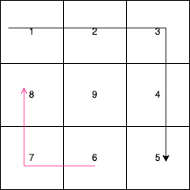

# 螺旋矩阵问题
这道题主要考察了边界条件，没有什么特别的算法，主要难点在于如何选择边界条件，并且转化步进方向。  
使用 3 * 3 的矩阵举例，我们可以看见当我们从左上角出发时，我们的步进方向先右再下，此时得到一个 2 * 2的正方形，步进方向正好相反，先左再上。  
  

同时我们可以发现，每组步进中，横向步进比纵向步进多步进一格，因此我们的代码思路已经初步完成。
```go
func generateMatrix(n int) [][]int {
	if n == 0 {
		return nil
	} // 特殊情况
	
	result := make([][]int, n) 
	for i := 0; i < n; i++ {
		result[i] = make([]int, n)
	}
	result[0][0] = 1 // 初始化数组
	
	step := 1 // 步进方向 向右/向下为1 反之为-1
	x, y := 0, 0
	for boundary := n - 1; boundary > -1; boundary-- { // 步进区间 [0, 2], 长度为3
		for i := 0; i <= boundary && y+step > -1 && y+step < n; i++ {
			result[x][y+step] = result[x][y] + 1
			y += step
		}

		for i := 0; i < boundary && x+step > 0 && x+step < n; i++ { // 步进区间 [0, 2), 长度为2
			result[x+step][y] = result[x][y] + 1
			x += step
		}

		step *= -1 // 更换步进方向
	}

	return result
}
```
