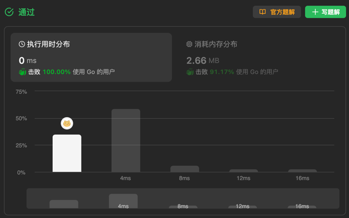

# 使用最小花费爬楼梯
正式进入了DP算法部分，第一次系统化地接触DP问题，学习了卡神的四步法：
- 确定DP数组含义
- 确定递推式
- 初始化DP数组
- 遍历DP数组

其实第一反应是回溯算法，但是回溯算法会导致大量的重复运算，无法记录状态，导致时间复杂度超出，同时回溯算法通常会伴随明显的**剪枝条件**，如果是回溯算法，本题的时间复杂度为O(n^2)，因为每一步都有2个选择，走一步或者走两步，回溯算法需要完整遍历。  
但是DP算法利用DP数组保存了子问题的状态，一是避免了大量重复计算，二是上层问题不需要去考虑各个情况，他只需要不断获取到子问题的最优解即可，如果是回溯算法，本题的时间复杂度为O(n)，仅需要遍历一次数组。

