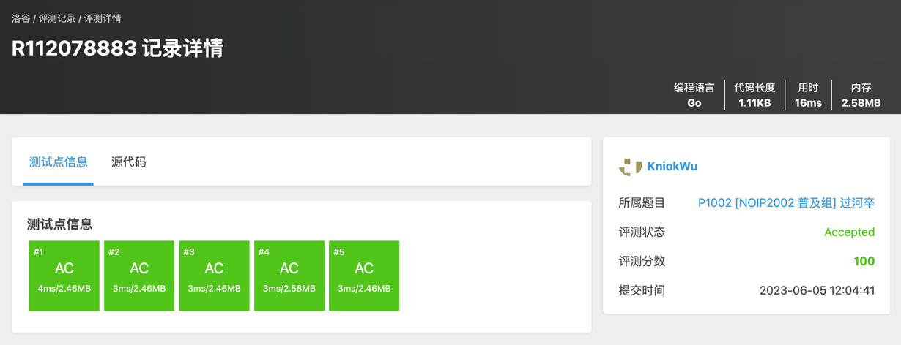

# 解题思路 (一)
假设求起始点到任意目标点(x, y)可选择的路径，由于只允许向右或者向下，因此可以很显而易见地想到到达目标点(x, y)有两种方法:
- 从 (x - 1, y) 前往 (x, y)
- 从 (x, y - 1) 前往 (x, y)

因此，问题f(x, y)就可以分解为以下递推式问题:
> f(x, y) = f(x - 1, y) + f(x, y - 1)

由题目示意图可以知道，我们可以用一个二维数组[][]matrix来对棋盘进行模拟，由于递推式为前两个点之和。  
在上式中，我们需要注意一个问题，就是 x - 1 和 y - 1 这两个值，可能存在 x 或者 y 为0的时候，出现数组下标越界问题，因此我们可以考虑在矩阵上边和矩阵左边添加一个padding层来解决这个问题。

此时我们的算法已经完成基本思路的构思，下面是算法的一个基本步骤:
- step 1. 读入b_x,b_y,h_x,h_y,分别为目标点x坐标，目标点y坐标，马点x坐标，马点y坐标。
- step 2. 初始化二维矩阵[][]matrix，在Go语言中，数组默认值设置为0，因此此处将马点设置为-1，表示无法通过。同时注意，由于坐标是从0开始到b_x结束，且额外添加了一层padding，因此matrix的大小应为(b_x + 2, b_y + 2)。
- step 3. 设置起始点(1, 1)的值为1，因为添加了一层padding，因此我们的起始点从(0, 0)变为了(1, 1)，且循环也从 (1, 1) 开始，按行从左到右依次便利。
- step 4. 判断 (x, y) 的值是否为 -1。是则设置 (x, y) 值为0；否则设置 (x, y) += (x - 1, y) + (x, y - 1)。
- step 5. 返回右下角点的值

结果:
